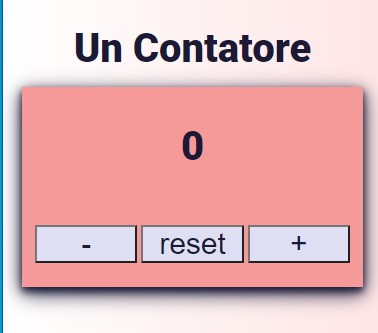
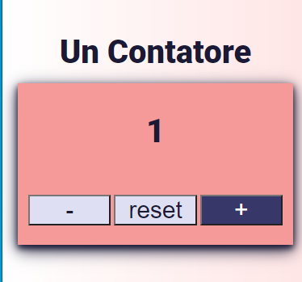

# Counter app
Simple Counter app. 

## Table of contents
* [General info](#general-info)
* [Technologies](#technologies)
* [Setup](#setup)
* [Illustrations](#illustrations)
* [Link](#illustrations)
* [Contributing](#contributing)

## General info
This application allows the user to increase and decrease the value of the counter.
	
## Technologies
Project is created with:
* HTML
* CSS
* JavaScript
	
## Setup
You don't have to install it since it's a JavaScript app and JavaScript is already running in your browser on your computer, on your tablet, and on your smart-phone.

## Illustrations

## Links
Link to App.
https://js-counter-js.netlify.app/

## Contributing
Pull requests are welcome. For major changes, please open an issue first to discuss what you would like to change.

Please make sure to update tests as appropriate.

## License
[MIT](https://choosealicense.com/licenses/mit/)
